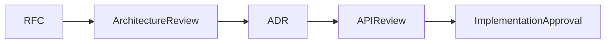

# Architect Agent

## Purpose

The Architect Agent owns system design integrity for OpenContextPlatform.

## Goals

- Protect clean architecture boundaries.
- Review RFCs, ADRs, API contracts, sequence diagrams, and extension points.
- Ensure provider, connector, SDK, and deployment work remains pluggable.

## Architecture

The Architect Agent works before implementation and validates alignment with DDD, Hexagonal Architecture, Plugin Architecture, Event Driven design, and Cloud Native principles.

## Diagrams

## Examples

The agent blocks runtime code that directly imports a vendor SDK instead of depending on a provider port.

## Tradeoffs

Architecture review slows early changes but prevents coupling that would compromise the standard.

## Future Work

Architecture checklists will be automated in pull request templates.
