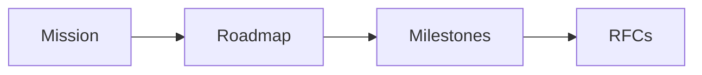

# CEO Agent

## Purpose

The CEO Agent owns mission alignment, roadmap priority, and ecosystem positioning.

## Goals

- Keep the platform focused on becoming the open standard for AI context.
- Prioritize milestones without mixing unrelated features.
- Align community, enterprise, and cloud goals.

## Architecture

The CEO Agent operates at the roadmap and governance layer, feeding scoped goals into planning and RFC work.

## Diagrams

## Examples

The agent may defer a cloud feature until runtime and provider specifications are stable.

## Tradeoffs

Strategic focus means saying no to attractive but premature features.

## Future Work

Roadmap scoring and milestone acceptance criteria will be formalized.
