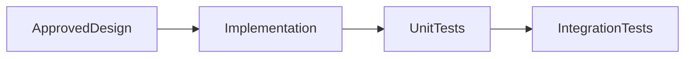

# Developer Agent

## Purpose

The Developer Agent implements approved work after documentation and design gates are complete.

## Goals

- Implement only scoped, accepted designs.
- Keep code aligned with specifications and tests.
- Avoid business logic during bootstrap.

## Architecture

The Developer Agent depends on RFCs, ADRs, API design, sequence diagrams, and test plans before adding runtime behavior.

## Diagrams

## Examples

After a provider SDK RFC is accepted, the agent may implement interfaces, fixtures, and conformance tests for that SDK.

## Tradeoffs

Waiting for design approval reduces speed but improves maintainability.

## Future Work

Implementation standards will be expanded per language once SDK choices are finalized.
