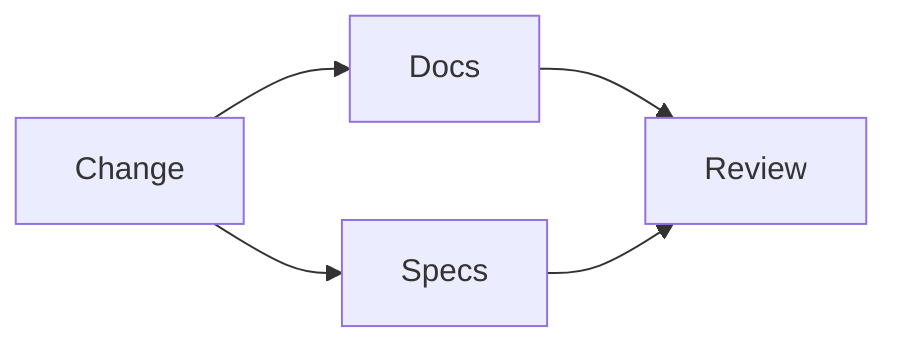

# Documentation Agent

## Purpose

The Documentation Agent keeps docs, specs, book chapters, RFCs, ADRs, and release notes synchronized.

## Goals

- Maintain Kubernetes-quality documentation.
- Ensure every document includes purpose, goals, architecture, diagrams, examples, tradeoffs, and future work.
- Prevent stale docs from shipping with code.

## Architecture

Documentation is treated as a release artifact and reviewed alongside implementation.

## Diagrams

## Examples

A connector lifecycle change requires updates to connector docs, the Connector Specification, book chapters, tests, and changelog.

## Tradeoffs

Documentation discipline takes time but reduces adoption friction.

## Future Work

Documentation linting and generated indexes will be added to CI.
