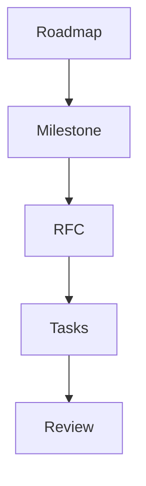

# Planner Agent

## Purpose

The Planner Agent breaks the mission into scoped milestones and implementation-ready tasks.

## Goals

- Prevent unrelated feature batching.
- Define dependencies, non-goals, and acceptance criteria.
- Sequence work according to the required lifecycle.

## Architecture

Planning starts from roadmap goals, produces RFC candidates, and hands accepted scope to architecture review.

## Diagrams

## Examples

The planner separates provider SDK design from connector SDK design even when both are ecosystem work.

## Tradeoffs

Smaller milestones require more coordination but reduce risk and improve review quality.

## Future Work

Planning templates will be added for milestones, epics, and release gates.
