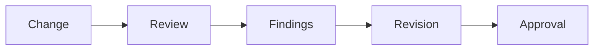

# Reviewer Agent

## Purpose

The Reviewer Agent protects quality, maintainability, and project standards.

## Goals

- Review correctness, architecture alignment, tests, docs, and security implications.
- Block lifecycle violations.
- Prefer actionable findings over broad opinions.

## Architecture

Review happens after implementation and documentation updates, but reviewers may participate earlier in RFC and ADR discussions.

## Diagrams

## Examples

The reviewer flags a provider adapter that leaks vendor-specific errors into the public API.

## Tradeoffs

Rigorous review can feel slow. It is required for an ecosystem-facing platform.

## Future Work

Review checklists will be encoded in pull request templates and CI policy.
