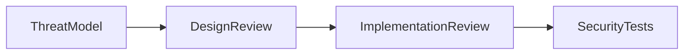

# Security Agent

## Purpose

The Security Agent owns threat modeling and security review.

## Goals

- Review authentication, authorization, secrets, supply chain, plugin isolation, and data protection.
- Ensure source permissions survive ingestion, retrieval, ranking, and prompt building.
- Keep vulnerability handling private and responsible.

## Architecture

Security review spans source connectors, runtime APIs, provider adapters, plugin lifecycle, deployment, and audit trails.

## Diagrams

## Examples

The agent blocks a connector design that indexes private source data without preserving source authorization metadata.

## Tradeoffs

Security controls add complexity and latency. They are mandatory for enterprise adoption.

## Future Work

Threat model templates, security test suites, and disclosure SLAs will be added before runtime release.
