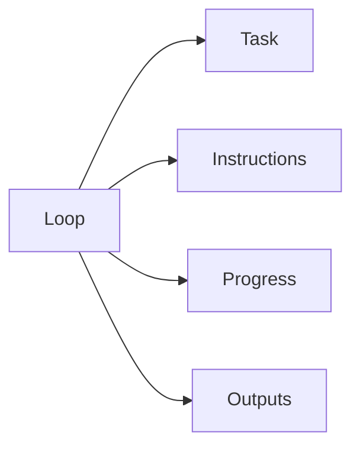

# Agentic Loops

## Purpose

This directory stores controlled agentic loop definitions for OpenContextPlatform.

## Goals

- Make agent work repeatable, inspectable, and bounded.
- Persist task state and outputs across iterations.
- Keep loop execution aligned with project lifecycle gates.

## Architecture

Each loop owns a task file, instruction file, progress file, and outputs directory. Loops may read repository context and update documentation within their explicit scope.

## Diagrams

## Examples

`sprint-001-foundation-specs` plans and tracks the foundation specification sprint.

## Tradeoffs

Persistent loop state can become stale. Each loop must record date, verification results, and stop conditions.

## Future Work

Future loops may be connected to CI, issue trackers, or scheduled execution after governance approves the automation model.
