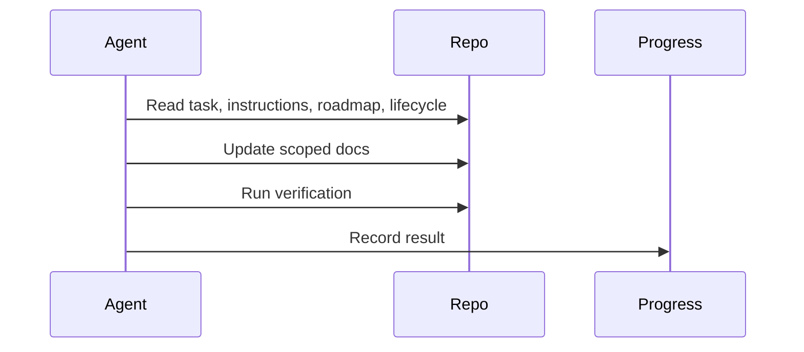

# Sprint 001 Loop Instructions

## Purpose

These instructions define how agents execute the Sprint 001 loop.

## Goals

- Read context before acting.
- Make scoped documentation changes.
- Verify required Markdown sections and lifecycle alignment.
- Persist progress after each iteration.

## Architecture

The loop uses four artifacts: `TASK.md` for objective, `LOOP_INSTRUCTIONS.md` for rules, `PROGRESS.md` for state, and `outputs/` for reviewable results.

## Diagrams

## Examples

If a verification check fails, the agent fixes documentation within sprint scope and records the fix. If implementation is required, the agent stops and escalates.

## Tradeoffs

Strict loop instructions reduce flexibility but make the work auditable.

## Future Work

Future instructions may define automated command allowlists and CI integration.
