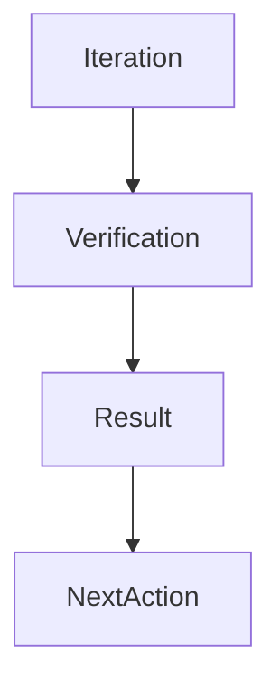

# Sprint 001 Loop Progress

## Purpose

This file records persistent state for the Sprint 001 loop.

## Goals

- Track completed loop iterations.
- Preserve verification outcomes.
- Make next actions explicit.

## Architecture

Progress entries are append-only summaries of loop execution, verification, stop conditions, and follow-up work.

## Diagrams

## Examples

### 2026-07-13 Iteration 1

- Planned Sprint 001 foundation specification scope.
- Updated roadmap with loop-based execution and sprint dates.
- Added sprint plan and agentic loop method documentation.
- Created loop task, instructions, progress, and outputs structure.
- Verification passed: every Markdown document includes the required Purpose, Goals, Architecture, Diagrams, Examples, Tradeoffs, and Future Work sections.
- Verification passed: implementation directories contain no files beyond README ownership documents.
- Stop condition met for Iteration 1: sprint planning and loop bootstrap completed without business logic implementation.

### 2026-07-13 Iteration 2

- Planned Sprint 001 implementation tasks.
- Added task dependencies, owner roles, outputs, and acceptance criteria.
- Updated loop task queue with S1-001 through S1-008.
- Next action: execute S1-001 specification maturity matrix.

### 2026-07-13 Iteration 3

- Completed S1-001: created `docs/sprints/sprint-001-specification-maturity.md`.
- Completed S1-002: created `rfcs/backlog.md`.
- Completed S1-003: created `adr/backlog.md`.
- Completed S1-004: created `docs/specification-review-checklist.md`.
- Changed files are documentation, RFC backlog, ADR backlog, and loop progress only.
- Verification passed: every Markdown document includes the required Purpose, Goals, Architecture, Diagrams, Examples, Tradeoffs, and Future Work sections.
- Verification passed: implementation directories contain no files beyond README ownership documents.
- Verification passed: S1-001 through S1-004 outputs exist and are non-empty.
- Next action: execute S1-005 conformance test strategy, then S1-006 security review checklist.

## Tradeoffs

Progress files are manual until CI automation exists. The benefit is clear continuity across agent sessions.

## Future Work

Future entries should include command results, changed files, unresolved risks, and review decisions.
