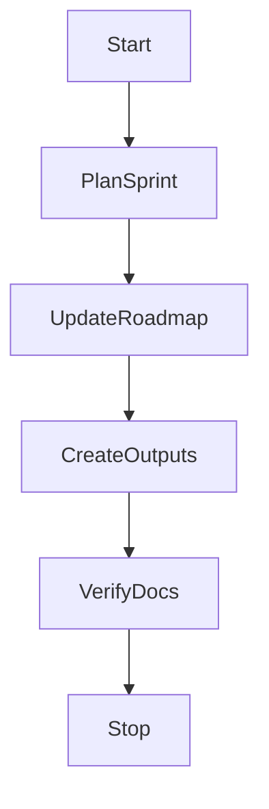

# Sprint 001 Loop Task

## Purpose

This task defines the controlled loop for Sprint 001: Foundation Specifications.

## Goals

- Plan Sprint 001 from the roadmap.
- Produce reviewable sprint outputs.
- Verify documentation compliance.
- Avoid runtime, provider, connector, SDK, deployment, or business logic implementation.

## Architecture

The loop operates only on documentation, planning, RFC, ADR, and specification artifacts. It follows the project lifecycle and stops before implementation gates.

## Diagrams

## Examples

Valid loop actions include updating `ROADMAP.md`, writing sprint docs, creating RFC backlog notes, recording progress, and running Markdown section checks.

### Sprint 001 Task Queue

- S1-001: Create specification maturity matrix.
- S1-002: Draft RFC backlog.
- S1-003: Draft ADR backlog.
- S1-004: Expand specification review checklist.
- S1-005: Define conformance test strategy.
- S1-006: Define security review checklist.
- S1-007: Produce Sprint 001 review package.
- S1-008: Verify documentation compliance and implementation boundary.

## Tradeoffs

The task is intentionally narrow. Broader automation will wait until governance, security, and CI controls are defined.

## Future Work

Future task revisions may add issue synchronization, sprint burndown, and automated release readiness summaries.
