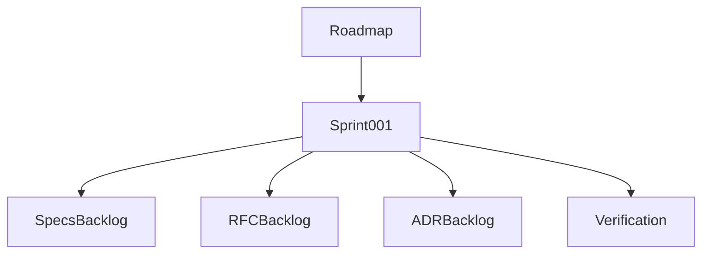

# Sprint 001 Plan Output

## Purpose

This output summarizes the executed planning loop for Sprint 001.

## Goals

- Establish Sprint 001 dates, scope, deliverables, and verification.
- Confirm the sprint remains documentation-only.
- Provide a review package for the next architecture pass.

## Architecture

Sprint 001 uses loop-driven planning with explicit task, instructions, progress, and outputs. It is bounded by the OpenContextPlatform lifecycle and stops before implementation.

## Diagrams

## Examples

Accepted Sprint 001 work includes improving specification maturity, drafting RFC candidates, expanding ADR coverage, and validating documentation quality.

### Planned Task Outputs

- `docs/sprints/sprint-001-specification-maturity.md`
- `rfcs/backlog.md`
- `adr/backlog.md`
- `docs/specification-review-checklist.md`
- `tests/conformance-strategy.md`
- `docs/security-review-checklist.md`
- `.ai/loops/sprint-001-foundation-specs/outputs/sprint-001-review-package.md`

## Tradeoffs

The sprint delays runtime scaffolding. This is intentional because the platform must establish stable contracts before implementation.

## Future Work

Next loop iterations should produce the RFC backlog, ADR backlog, and specification maturity matrix.
