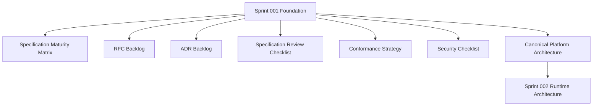

# Sprint 001 Review Package

## Purpose

This package summarizes the completed Sprint 001 foundation work for OpenContextPlatform.

## Goals

- Confirm that Sprint 001 produced the planned documentation, specification, RFC, ADR, conformance, and security artifacts.
- Identify open risks and unresolved decisions before Sprint 002 begins.
- Provide a release readiness statement for the documentation foundation.
- Preserve the decision that no runtime business logic was implemented during Sprint 001.

## Architecture

Sprint 001 established the planning and review foundation for a specification-first platform. The work followed the loop model: task definition, scoped execution, verification, persisted progress, and reviewable outputs. The resulting architecture baseline is layered around AI agent interfaces, platform capabilities, core context services, intelligence services, connectors, providers, and bring-your-own infrastructure.

## Diagrams

## Examples

Completed Sprint 001 outputs:

| Task | Output | Status |
| --- | --- | --- |
| S1-001 | `docs/sprints/sprint-001-specification-maturity.md` | Complete |
| S1-002 | `rfcs/backlog.md` | Complete |
| S1-003 | `adr/backlog.md` | Complete |
| S1-004 | `docs/specification-review-checklist.md` | Complete |
| S1-005 | `tests/conformance-strategy.md` | Complete |
| S1-006 | `docs/security-review-checklist.md` | Complete |
| Architecture alignment | `README.md`, `docs/architecture.md`, `docs/assets/architecture/open-context-platform-architecture.png` | Complete |
| S1-007 | `.ai/loops/sprint-001-foundation-specs/outputs/sprint-001-review-package.md` | Complete |

### Open Risks

| Risk | Impact | Mitigation |
| --- | --- | --- |
| All official specifications remain Draft | Runtime implementation cannot safely begin | Draft RFC-002, RFC-003, and RFC-009 before runtime code |
| Plugin isolation model is undecided | Provider and connector implementation could create security debt | Prioritize RFC-005 and ADR-005 in Sprint 002 |
| API schema strategy is undecided | SDK and conformance work could drift | Prioritize RFC-008 before SDK scaffolding |
| Security model is not yet accepted | Connector, memory, prompt, and enterprise features remain blocked | Prioritize RFC-010 and ADR-009 |
| Conformance tests are not executable yet | Compatibility cannot be mechanically verified | Convert `tests/conformance-strategy.md` into fixtures only after RFC-009 is accepted |

### Unresolved Decisions

| Decision | Blocking Area | Required Artifact |
| --- | --- | --- |
| Specification stability levels | Spec promotion beyond Draft | RFC-003 and ADR-002 |
| Runtime architecture boundaries | Runtime package layout and service boundaries | RFC-004 and ADR-004 |
| Plugin lifecycle and isolation | Provider and connector plugin implementation | RFC-005 and ADR-005 |
| API versioning and schemas | Public APIs, SDKs, and conformance | RFC-008 and ADR-003 |
| Enterprise security posture | Auth, tenancy, connectors, memory, prompt safety | RFC-010 and ADR-009 |

### Sprint 002 Recommendations

Sprint 002 should focus on runtime architecture readiness, not business feature implementation.

Recommended Sprint 002 sequence:

1. Draft RFC-002 Context Object Contract.
2. Draft RFC-003 Specification Stability and Versioning.
3. Draft RFC-004 Runtime Architecture.
4. Draft RFC-005 Plugin Lifecycle and Isolation.
5. Draft RFC-008 API Versioning and Schema Strategy.
6. Draft RFC-010 Security Model.
7. Record ADR-002, ADR-003, ADR-004, ADR-005, and ADR-009 only after RFC review.

### Release Readiness Statement

The Sprint 001 documentation foundation is review-ready as a planning milestone. It is not implementation-ready for runtime behavior. The repository is ready to begin Sprint 002 RFC drafting once maintainers accept the Sprint 001 review package.

## Tradeoffs

Sprint 001 invested in planning artifacts instead of runtime code. This delays executable demos, but it creates the architecture discipline needed for an open standard with providers, connectors, SDKs, conformance tests, and enterprise security.

## Future Work

Future work should convert the highest-priority RFC backlog items into full RFC documents, record accepted ADRs, and then update the specifications from Draft toward Review Ready.
