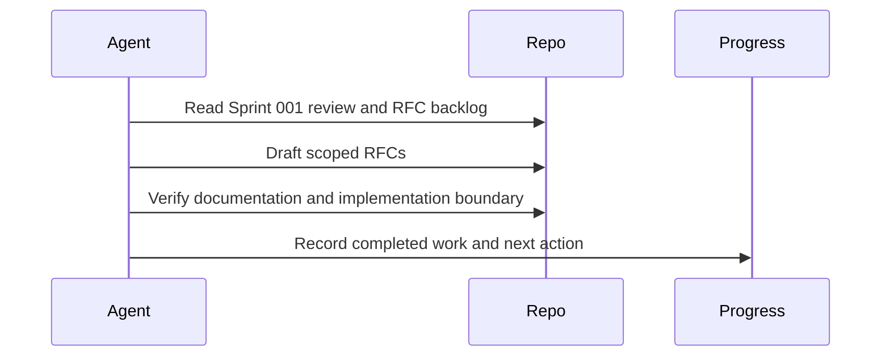

# Sprint 002 Loop Instructions

## Purpose

These instructions define how agents execute the Sprint 002 runtime architecture loop.

## Goals

- Read Sprint 001 review output before drafting.
- Keep RFCs decision-oriented and implementation-blocking.
- Record progress after each iteration.
- Run verification before declaring the sprint complete.

## Architecture

The loop uses `TASK.md`, `LOOP_INSTRUCTIONS.md`, `PROGRESS.md`, and `outputs/` to keep work bounded and auditable.

## Diagrams

## Examples

If an RFC requires a decision that cannot be derived from current docs, record it as an unresolved decision rather than implementing around it.

## Tradeoffs

Strict loop controls slow down runtime work, but they keep RFCs reviewable and prevent architecture drift.

## Future Work

Future instructions may include RFC template validation and automated cross-link checks.
