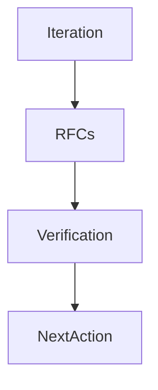

# Sprint 002 Loop Progress

## Purpose

This file records persistent state for the Sprint 002 runtime architecture loop.

## Goals

- Track Sprint 002 RFC drafting progress.
- Preserve verification outcomes.
- Make unresolved decisions and next actions explicit.

## Architecture

Progress entries are append-only records of loop execution, verification, stop conditions, and handoff decisions.

## Diagrams

## Examples

### 2026-07-13 Iteration 1

- Planned Sprint 002 runtime architecture task queue.
- Created Sprint 002 loop artifacts.
- Started execution with RFC-002 and RFC-003 drafts.
- Completed S2-001: created `rfcs/0002-context-object-contract.md`.
- Completed S2-002: created `rfcs/0003-specification-stability-and-versioning.md`.
- Updated `ROADMAP.md` and `rfcs/backlog.md` for Sprint 002 status.
- Next action: execute S2-003 RFC-004 Runtime Architecture.

### 2026-07-13 Iteration 2

- Completed S2-003: created `rfcs/0004-runtime-architecture.md`.
- Completed S2-004: created `rfcs/0005-plugin-lifecycle-and-isolation.md`.
- Completed S2-005: created `rfcs/0008-api-versioning-and-schema-strategy.md`.
- Completed S2-006: created `rfcs/0010-security-model.md`.
- Updated `rfcs/backlog.md` to mark Sprint 002 RFC drafts as created.
- Next action: produce S2-007 Sprint 002 review package, then run S2-008 verification.

### 2026-07-13 Iteration 3

- Completed S2-007: created `.ai/loops/sprint-002-runtime-architecture/outputs/sprint-002-review-package.md`.
- Included completed RFC outputs, ADR recommendations, open risks, and release readiness statement.
- Completed S2-008: ran final verification.
- Verification passed: every Markdown document includes the required Purpose, Goals, Architecture, Diagrams, Examples, Tradeoffs, and Future Work sections.
- Verification passed: application, runtime, package, provider, connector, SDK, deployment, and example directories contain no implementation files beyond README ownership documents.
- Verification passed: `tests/` contains only README and the approved conformance strategy planning document.
- Verification passed: all Sprint 002 RFC and review package outputs exist and are non-empty.
- Stop condition met for Sprint 002 drafting: runtime implementation remains blocked until RFC review and ADR acceptance.
- Next action: review RFC-002, RFC-003, RFC-004, RFC-005, RFC-008, and RFC-010, then record accepted ADRs.

### 2026-07-13 Iteration 4

- Reviewed Sprint 002 RFC set for architecture approval.
- Accepted RFC-002 through ADR-011.
- Accepted RFC-003 through ADR-002.
- Accepted RFC-008 through ADR-003.
- Accepted RFC-004 through ADR-004.
- Accepted RFC-005 through ADR-005.
- Accepted RFC-010 through ADR-009.
- Updated `adr/backlog.md` with accepted ADR links and remaining blockers.
- Verification passed: every Markdown document includes the required Purpose, Goals, Architecture, Diagrams, Examples, Tradeoffs, and Future Work sections.
- Verification passed: application, runtime, package, provider, connector, SDK, deployment, and example directories contain no implementation files beyond README ownership documents.
- Verification passed: `tests/` contains only README and the approved conformance strategy planning document.
- Verification passed: accepted ADR files exist and are non-empty.
- Next action: draft context schema/API/database/sequence design tasks before runtime scaffolding.

## Tradeoffs

Manual progress records require discipline, but they make long-running architecture work resumable.

## Future Work

Future entries should record completed RFCs, verification results, open decisions, and review package status.
