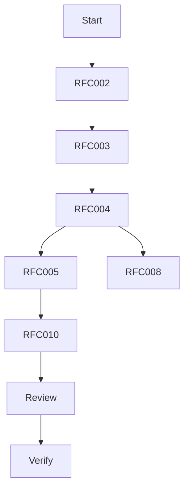

# Sprint 002 Loop Task

## Purpose

This task defines the controlled loop for Sprint 002: Runtime Architecture RFCs.

## Goals

- Draft runtime-readiness RFCs.
- Persist progress and outputs.
- Verify documentation compliance.
- Avoid runtime, provider, connector, SDK, deployment, or executable test implementation.

## Architecture

The loop operates on RFC, sprint, architecture, review, and progress artifacts only. It stops before ADR acceptance and before runtime implementation.

## Diagrams

## Examples

Valid loop actions include creating RFC documents, updating sprint docs, recording progress, and running documentation checks.

### Sprint 002 Task Queue

- S2-001: Draft RFC-002 Context Object Contract.
- S2-002: Draft RFC-003 Specification Stability and Versioning.
- S2-003: Draft RFC-004 Runtime Architecture.
- S2-004: Draft RFC-005 Plugin Lifecycle and Isolation.
- S2-005: Draft RFC-008 API Versioning and Schema Strategy.
- S2-006: Draft RFC-010 Security Model.
- S2-007: Produce Sprint 002 review package.
- S2-008: Verify Sprint 002 compliance and implementation boundary.

## Tradeoffs

The loop creates architecture artifacts rather than executable code. That protects the project from prematurely hardening unstable boundaries.

## Future Work

Future loop iterations should create ADRs only after RFC review is complete.
