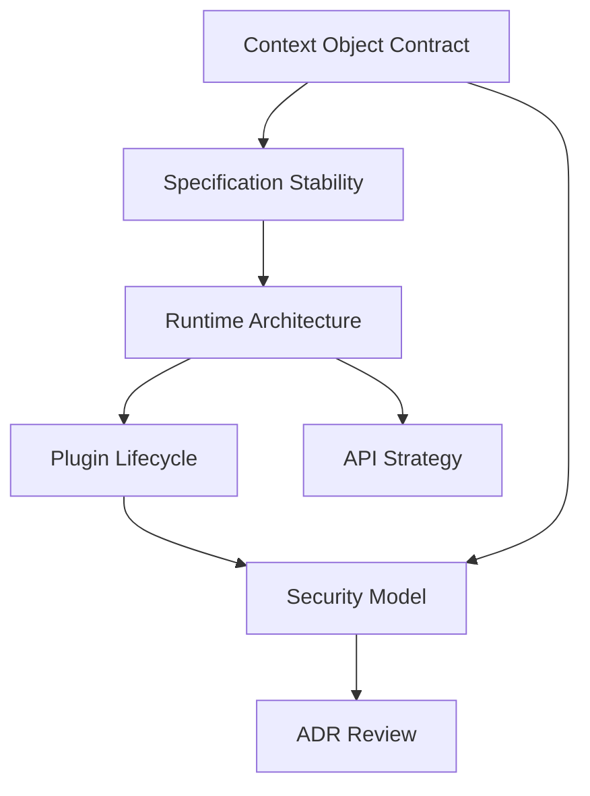

# Sprint 002 Review Package

## Purpose

This package summarizes the Sprint 002 runtime architecture RFC drafting work.

## Goals

- Confirm that Sprint 002 produced the planned runtime-readiness RFC drafts.
- Identify open decisions that must become ADRs before implementation.
- Preserve the implementation stop condition.
- Recommend the next review and ADR sequence.

## Architecture

Sprint 002 converts Sprint 001 planning into RFC drafts for context object semantics, specification stability, runtime boundaries, plugin lifecycle, API/schema strategy, and security model. These RFCs are review artifacts only; they do not authorize runtime implementation until accepted and recorded in ADRs.

## Diagrams

## Examples

Completed Sprint 002 outputs:

| Task | Output | Status |
| --- | --- | --- |
| S2-001 | `rfcs/0002-context-object-contract.md` | Complete |
| S2-002 | `rfcs/0003-specification-stability-and-versioning.md` | Complete |
| S2-003 | `rfcs/0004-runtime-architecture.md` | Complete |
| S2-004 | `rfcs/0005-plugin-lifecycle-and-isolation.md` | Complete |
| S2-005 | `rfcs/0008-api-versioning-and-schema-strategy.md` | Complete |
| S2-006 | `rfcs/0010-security-model.md` | Complete |
| S2-007 | `.ai/loops/sprint-002-runtime-architecture/outputs/sprint-002-review-package.md` | Complete |

### ADR Recommendations

| ADR | Should Be Created After | Decision |
| --- | --- | --- |
| ADR-002 | RFC-003 review | Adopt specification stability levels |
| ADR-003 | RFC-008 review | Adopt API-first contract strategy |
| ADR-004 | RFC-004 review | Adopt runtime Clean Architecture boundaries |
| ADR-005 | RFC-005 review | Adopt plugin lifecycle and isolation model |
| ADR-009 | RFC-010 review | Adopt enterprise security posture |

### Open Risks

| Risk | Impact | Mitigation |
| --- | --- | --- |
| RFCs are drafted but not accepted | Runtime implementation remains blocked | Conduct RFC review and record ADRs |
| JSON Schema source of truth is unresolved | SDK and API generation may drift | Resolve in RFC-008 review and ADR-003 |
| Plugin isolation model is unresolved | Provider and connector code remains blocked | Resolve in RFC-005 review and ADR-005 |
| Security policy model is unresolved | Enterprise features remain blocked | Resolve in RFC-010 review and ADR-009 |
| Control plane and data plane deployment split is unresolved | Runtime topology remains conceptual | Resolve in RFC-004 review or follow-up RFC |

### Release Readiness Statement

Sprint 002 is review-ready as an RFC drafting milestone. It is not implementation-ready. Runtime scaffolding, provider plugins, connector plugins, SDKs, schemas, and executable tests remain blocked until RFC review and ADR acceptance.

## Tradeoffs

Sprint 002 created multiple RFC drafts in one architecture slice. This increases review load, but the documents are interdependent and together define the minimum decision surface for future runtime work.

## Future Work

Future work should review the RFCs, revise them, record accepted ADRs, update specifications from Draft toward Review Ready, and only then plan runtime scaffolding.
