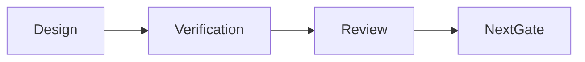

# Sprint 003 Loop Progress

## Purpose

This file records persistent state for the Sprint 003 context design loop.

## Goals

- Track design-gate completion.
- Preserve verification results.
- Make the next implementation gate explicit.

## Architecture

Progress entries summarize design artifacts, verification, blockers, and next actions.

## Diagrams

## Examples

### 2026-07-13 Iteration 1

- Created Sprint 003 context design plan.
- Created context schema design.
- Created context API design.
- Created context database design.
- Created context sequence design.
- Verification passed: every Markdown document includes the required Purpose, Goals, Architecture, Diagrams, Examples, Tradeoffs, and Future Work sections.
- Verification passed: application, runtime, package, provider, connector, SDK, deployment, and example directories contain no implementation files beyond README ownership documents.
- Verification passed: `tests/` contains only README and the approved conformance strategy planning document.
- Verification passed: context design outputs exist and are non-empty.
- Runtime implementation remains blocked until design review.

### 2026-07-13 Iteration 2

- Fixed review blocker: added Sprint 003 review package.
- Fixed review blocker: added lifecycle update, deletion, redaction, and stale-state sequence diagram.
- Fixed review blocker: added append-only audit persistence model to context database design.
- Verification passed: every Markdown document includes the required Purpose, Goals, Architecture, Diagrams, Examples, Tradeoffs, and Future Work sections.
- Verification passed: implementation directories contain no business logic files.
- Verification passed: targeted review blocker checks found review package, lifecycle sequence, and append-only audit model.
- Next action: request Sprint 003 design approval.

## Tradeoffs

Progress is manual for now, but it keeps architecture work resumable and reviewable.

## Future Work

Future entries should record final verification, review package creation, and runtime scaffolding readiness.
