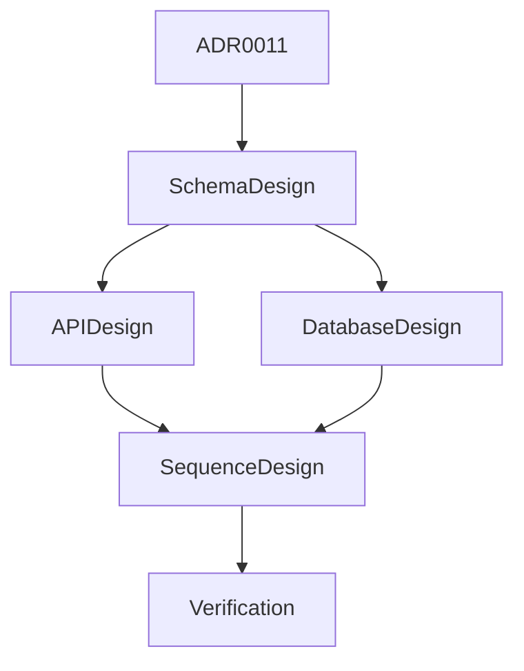

# Sprint 003 Loop Task

## Purpose

This task defines the controlled loop for Sprint 003: Context Design Gates.

## Goals

- Produce context schema, API, database, and sequence design documents.
- Keep runtime implementation blocked.
- Persist progress and verification results.

## Architecture

The loop operates only on design, planning, and progress artifacts. It follows accepted RFCs and ADRs from Sprint 002.

## Diagrams

## Examples

Valid loop actions include creating design docs, updating roadmap progress, recording loop progress, and running documentation checks.

## Tradeoffs

The loop still avoids code even though ADRs are accepted. The project requires database, API, and sequence design before implementation.

## Future Work

Future iterations should create a Sprint 003 review package and plan runtime scaffolding only after design review.
