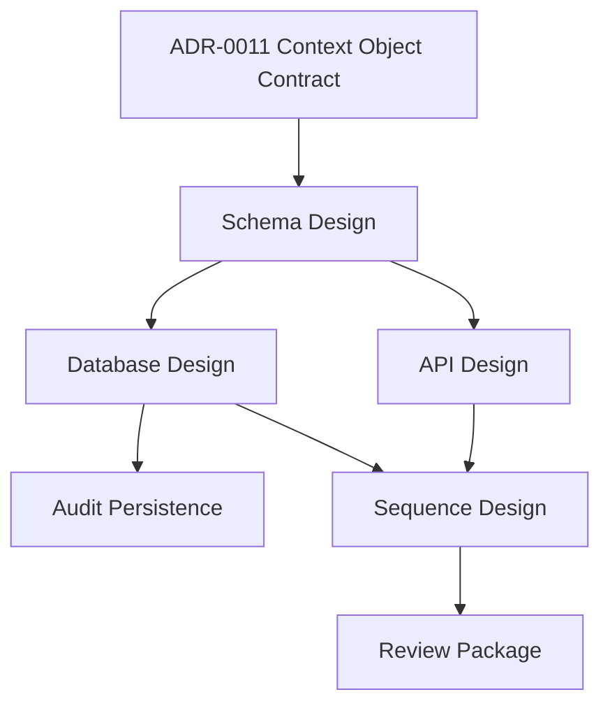

# Sprint 003 Review Package

## Purpose

This package summarizes the Sprint 003 context design gate work.

## Goals

- Confirm that context schema, API, database, and sequence design artifacts exist.
- Summarize review blockers and fixes.
- State whether the design gate is ready for approval.
- Preserve the implementation stop condition until runtime scaffolding is explicitly planned.

## Architecture

Sprint 003 translates accepted RFC and ADR decisions into design artifacts for the context object lifecycle. The design covers schema-ready field groups, context API capabilities, provider-neutral persistence models, audit persistence, and sequence diagrams for ingestion, retrieval, and lifecycle updates.

## Diagrams

## Examples

Completed Sprint 003 outputs:

| Deliverable | Output | Status |
| --- | --- | --- |
| Context schema design | `docs/context-schema-design.md` | Complete |
| Context API design | `docs/context-api-design.md` | Complete |
| Context database design | `docs/context-database-design.md` | Complete |
| Context sequence design | `docs/context-sequence-design.md` | Complete |
| Sprint 003 review package | `.ai/loops/sprint-003-context-design/outputs/sprint-003-review-package.md` | Complete |

### Review Blockers Addressed

| Finding | Resolution |
| --- | --- |
| Missing Sprint 003 review package | Added this review package |
| Missing lifecycle sequence diagram | Added lifecycle update, deletion, redaction, and stale-state sequence |
| Missing audit persistence model | Added append-only audit log responsibilities and design decisions |

### Approval Readiness

Sprint 003 is ready for design approval as a documentation and architecture milestone. Runtime implementation is still blocked until the next milestone explicitly plans machine-readable schemas, OpenAPI design, database schema design, sequence review acceptance, and runtime scaffolding.

## Tradeoffs

The review package keeps implementation blocked even after design blockers are fixed. That is intentional because the next milestone must decide whether to create machine-readable schemas first or runtime scaffolding first.

## Future Work

Plan the next milestone for context JSON Schema, OpenAPI skeleton, provider-neutral database schema, conformance fixtures, and runtime scaffolding boundaries.
