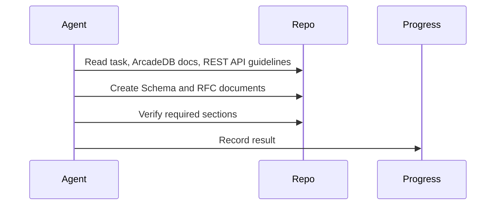

# Sprint 004 Loop Instructions

## Purpose

These instructions define how agents execute the Sprint 004 design loop.

## Goals

- Read the Context API and ArcadeDB requirements before acting.
- Draft necessary RFCs and schemas.
- Ensure all artifacts pass standard Markdown sections and lifecycle alignment.
- Persist progress after each iteration.

## Architecture

The loop uses four artifacts: `TASK.md` for objective, `LOOP_INSTRUCTIONS.md` for rules, `PROGRESS.md` for state, and `outputs/` for reviewable results.

## Diagrams

## Examples

If the schema design is missing vector embedding considerations, the agent will update the documentation to include it before recording progress.

## Tradeoffs

Strict adherence to the loop format slows down immediate progress but ensures high-quality, reviewable specs.

## Future Work

Future instructions might include automated spectral linting for the OpenAPI specs generated in this sprint.
