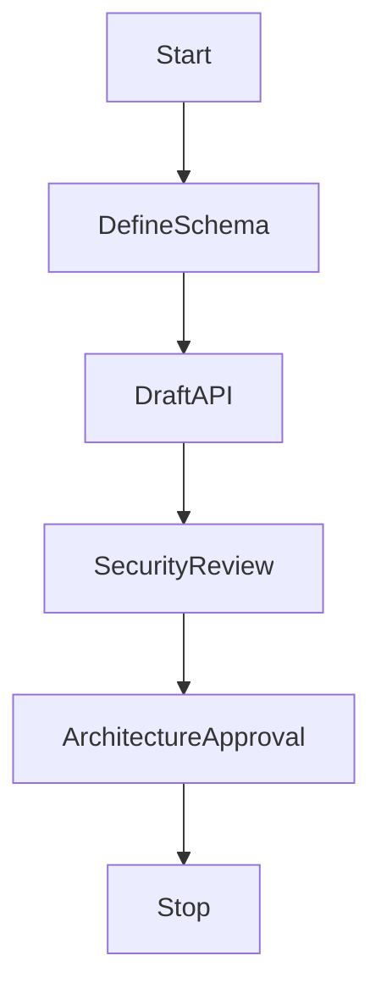

# Sprint 004 Loop Task

## Purpose

This task defines the controlled loop for Sprint 004: Phase 2 Runtime Design.

## Goals

- Create RFCs and OpenAPI definitions for the Context API, Memory Engine, and Retrieval Engine.
- Finalize the database schema mapping for ArcadeDB as the primary unified database.
- Obtain Security and Architecture review approvals before proceeding to implementation.

## Architecture

The loop operates entirely within the design phase, producing reviewable specs, RFCs, and schemas. It strictly avoids runtime code implementation.

## Diagrams

## Examples

Valid loop actions include updating `docs/sprints/sprint-004-phase2-runtime-design.md`, creating new `rfcs/`, writing OpenAPI specs in `specs/`, and tracking progress in `PROGRESS.md`.

### Sprint 004 Task Queue

- S4-001: ArcadeDB Unified Schema Design
- S4-002: Context API OpenAPI Specs
- S4-003: Prompt Builder Architecture RFC
- S4-004: Security Review for API
- S4-005: Produce Sprint 004 Review Package

## Tradeoffs

Designing the multi-modal database schema up front delays code writing but ensures data consistency across the Context Engine.

## Future Work

Once this design loop completes and receives approval, the Sprint 005 implementation loop will take over.
