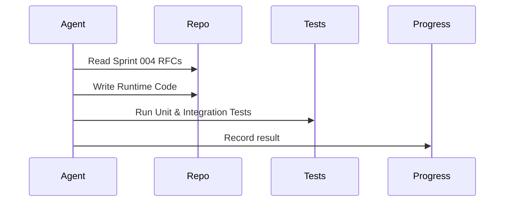

# Sprint 005 Loop Instructions

## Purpose

These instructions define how agents execute the Sprint 005 implementation loop.

## Goals

- Read the approved Sprint 004 designs before writing any code.
- Write executable runtime code targeting the ArcadeDB default engine.
- Write passing tests.
- Persist progress after each iteration.

## Architecture

The loop uses four artifacts: `TASK.md` for objective, `LOOP_INSTRUCTIONS.md` for rules, `PROGRESS.md` for state, and `outputs/` for reviewable artifacts like test coverage reports.

## Diagrams

## Examples

If a test fails, the agent must fix the implementation and rerun the test suite before checking off the task in `PROGRESS.md`.

## Tradeoffs

The requirement to have all tests passing before marking a task complete slows down execution but guarantees Definition of Done compliance.

## Future Work

Future instructions may include running automated security scanning against the implementation.
