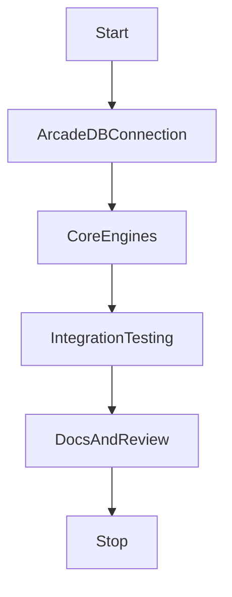

# Sprint 005 Loop Task

## Purpose

This task defines the controlled loop for Sprint 005: Phase 2 Runtime Implementation.

## Goals

- Implement the core Context API, Memory Engine, and Retrieval Engine based on Sprint 004 designs.
- Wire up the ArcadeDB Connection Provider for unified database access.
- Write Unit and Integration Tests.
- Pass Review to reach the Definition of Done.

## Architecture

This loop translates the approved RFCs and Schemas into executable code under the `runtime/` and `packages/` directories.

## Diagrams

## Examples

Valid loop actions include writing Python/Go code in `runtime/`, setting up Docker configurations for ArcadeDB, and running local test suites.

### Sprint 005 Task Queue

- S5-001: ArcadeDB Connection Provider
- S5-002: Implement Memory Engine
- S5-003: Implement Retrieval & Ranking
- S5-004: Implement Prompt Builder
- S5-005: Integration Testing against ArcadeDB
- S5-006: Sprint 005 Release Review

## Tradeoffs

Implementing across relational, vector, and graph paradigms simultaneously increases sprint complexity but reduces technical debt later.

## Future Work

Once this implementation is approved and released, Provider SDK Sprints (Sprint 006/007) will begin.
