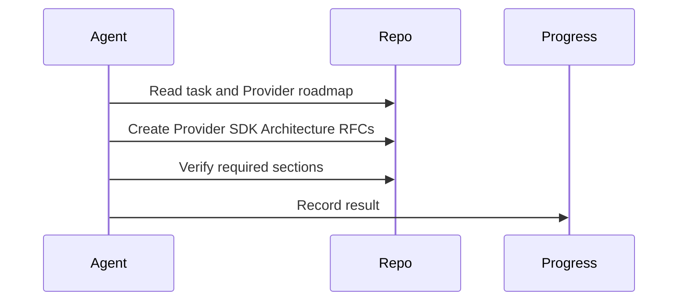

# Sprint 006 Loop Instructions

## Purpose

These instructions define how agents execute the Sprint 006 design loop.

## Goals

- Read the Phase 3 Roadmap deliverables before acting.
- Draft RFCs and specification documents defining the Provider SDK contracts.
- Ensure all artifacts pass standard Markdown sections and lifecycle alignment.
- Persist progress after each iteration.

## Architecture

The loop uses four artifacts: `TASK.md` for objective, `LOOP_INSTRUCTIONS.md` for rules, `PROGRESS.md` for state, and `outputs/` for reviewable results.

## Diagrams

## Examples

The agent should define the abstract class methods (e.g., `generate_text`, `get_embeddings`) in an architecture document before any Python interfaces are written.

## Tradeoffs

Strict adherence to the loop format slows down immediate progress but ensures high-quality, reviewable specs.
