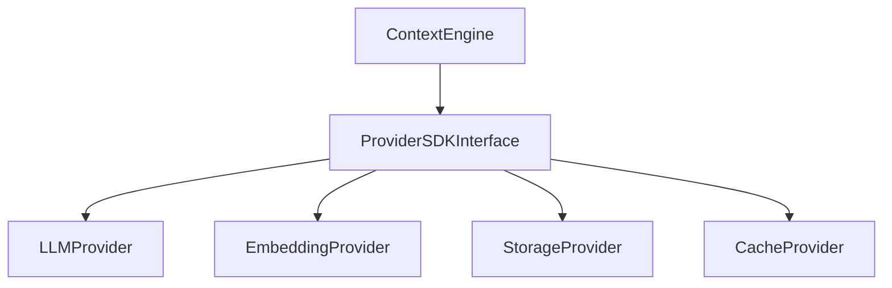

# Sprint 006 Loop Task

## Purpose

This task defines the controlled loop for Sprint 006: Phase 3 Provider SDK Design.

## Goals

- Design the abstraction layer for "Bring Your Own Providers" (Phase 3).
- Define the base interfaces/contracts for LLM, Embedding, Storage, and Cache providers.
- Maintain the "Documentation-First" principle by restricting this loop to architecture and RFC generation.

## Architecture

The Provider SDK ensures the core Context Runtime (built in Phase 2) remains fully decoupled from specific external models (e.g., OpenAI, Anthropic) or external blob/cache storage (e.g., S3, Redis).

## Diagrams

## Examples

Valid loop actions include creating `rfcs/0013-provider-sdk-architecture.md`, updating `specs/` with provider payload definitions, and updating `PROGRESS.md`.

### Sprint 006 Task Queue

- S6-001: Define Provider SDK Architecture (RFC 0013)
- S6-002: LLM & Embedding Provider Contracts
- S6-003: Storage & Cache Provider Contracts
- S6-004: Produce Sprint 006 Review Package

## Tradeoffs

Abstracting every provider adds boilerplate code to the SDK, but it is necessary to fulfill the mission of an open, provider-agnostic Context Infrastructure.

## Future Work

Once these SDK contracts are approved, Sprint 007 will implement the SDK packages in Python.
