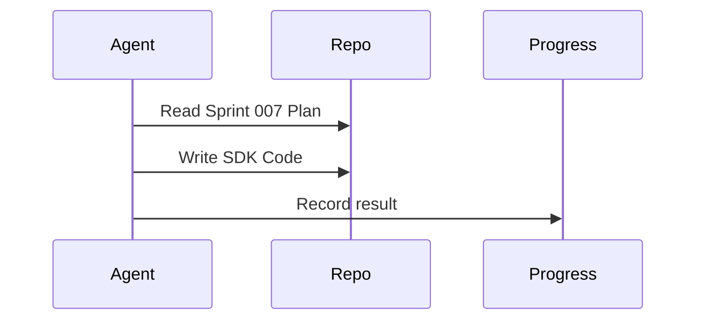

# Sprint 007 Loop Instructions

## Purpose

These instructions define how agents execute the Sprint 007 implementation loop.

## Goals

- Read the approved `implementation_plan.md` and user comments before writing any code.
- Write executable Python code for the Provider SDK interfaces and implementations.
- Persist progress after each iteration.

## Architecture

The loop uses four artifacts: `TASK.md` for objective, `LOOP_INSTRUCTIONS.md` for rules, `PROGRESS.md` for state, and `outputs/` for reviewable artifacts.

## Diagrams

## Examples

The agent must create `packages/provider_sdk/interfaces/llm.py` before creating `packages/provider_sdk/implementations/openai.py`.

## Tradeoffs

This loop requires massive code generation. The agent must ensure Python files are structurally sound.
