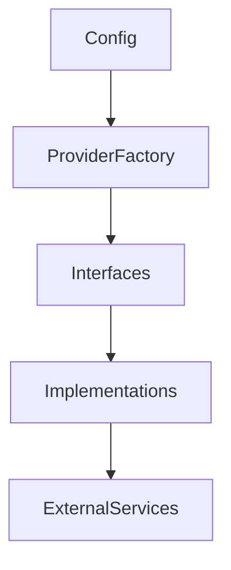

# Sprint 007 Loop Task

## Purpose

This task defines the controlled loop for Sprint 007: Phase 3 Provider SDK Implementation.

## Goals

- Implement abstract base classes (interfaces) in Python for all 8 provider types: LLM, Embedding, Reranker, Vector DB, Graph DB, Storage, Cache, and SQL/Metadata.
- Implement reference providers for all 8 types to prove the architecture.
- Create a `ProviderFactory` to dynamically load the implementations.
- Write tests to ensure the Provider SDK is fully functional.

## Architecture

The Provider SDK lives under `packages/provider_sdk/`. It has `interfaces/` defining the contracts, `implementations/` containing specific integrations, and a `factory.py` for dynamic loading.

## Diagrams

## Examples

If `config["llm"] == "openai"`, the factory returns `OpenAILLMProvider` which implements `ILLMProvider`.

### Sprint 007 Task Queue

- S7-001: Update `provider-contracts.md`
- S7-002: Implement Python Interfaces
- S7-003: Implement Python Reference Implementations
- S7-004: Implement `ProviderFactory`
- S7-005: Produce Sprint 007 Review Package

## Tradeoffs

Building out 8 distinct interfaces and reference implementations in one sprint is heavy, but necessary to support the "Bring Your Own Infrastructure" mission immediately.

## Future Work

Once this is complete, we move to Phase 4: Connector SDKs.
