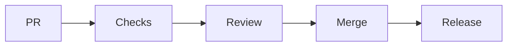

# GitHub Automation

## Purpose

This directory will contain GitHub workflows, issue templates, pull request templates, and release automation for OpenContextPlatform.

## Goals

- Enforce lifecycle gates.
- Run tests, linting, security scans, documentation checks, and conformance suites.
- Make releases reproducible.

## Architecture

Automation will be organized around foundation, runtime, SDK, provider, connector, deployment, and documentation pipelines.

## Diagrams

## Examples

Planned workflows include markdown validation, spec linting, unit tests, integration tests, Playwright tests, Locust tests, benchmark checks, coverage gates, and SBOM generation.

## Tradeoffs

Strict automation can slow small changes. The project accepts that cost to protect specification quality and downstream trust.

## Future Work

Workflow files will be added after the corresponding tools and package structure are specified.
