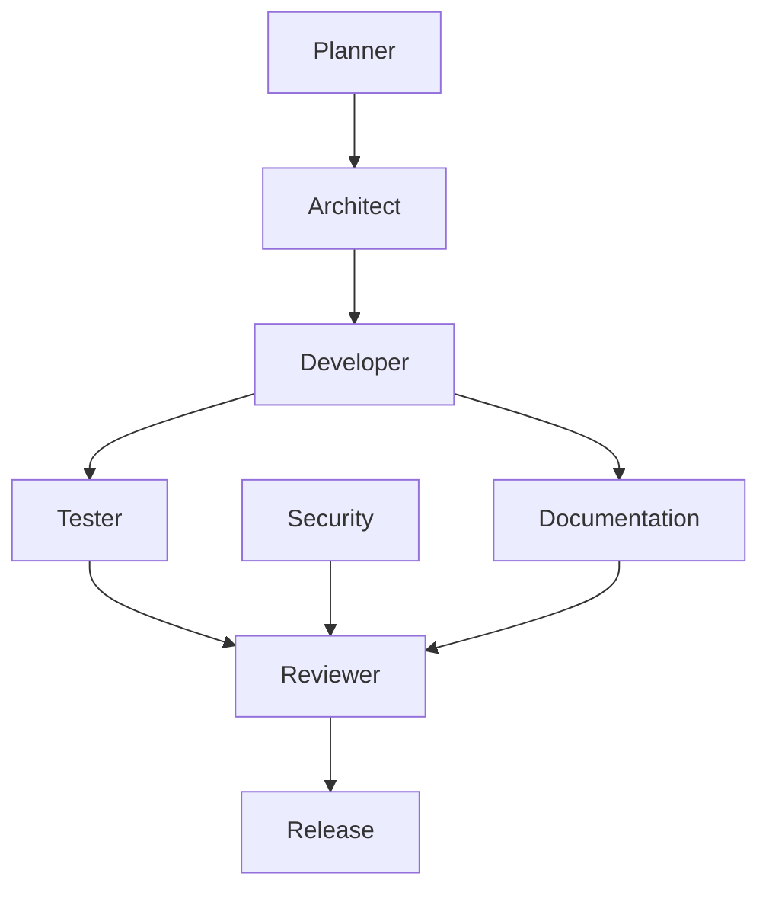

# AGENTS

## Purpose

This document defines agent responsibilities for OpenContextPlatform. Agents are roles in the engineering lifecycle, not autonomous permission to bypass architecture review.

## Goals

- Preserve specification-first development.
- Keep design, implementation, testing, security, and documentation accountable.
- Make review expectations explicit for human and AI contributors.

## Architecture

Agents collaborate through the required lifecycle: GitHub Issue Creation, RFC, Architecture, Database Design, API Design, Sequence Diagram, Implementation, Unit Tests, Integration Tests, Documentation, Review, and Release.

**CRITICAL RULE:** No implementation or coding may begin until a formal GitHub Issue has been created, tagged, and assigned.

## Diagrams

## Examples

- Planner: defines milestone scope and non-goals.
- Architect: owns RFCs, ADRs, system boundaries, and extension points.
- Developer: implements approved designs only.
- Tester: owns unit, integration, benchmark, and coverage strategy.
- Security: reviews threat models, authentication, authorization, secrets, and supply chain.
- Documentation: keeps book, docs, specs, and changelog synchronized.
- Reviewer: blocks changes that skip lifecycle gates.

## Tradeoffs

Role separation adds ceremony. The tradeoff is intentional because this project aims to define infrastructure contracts that downstream platforms can trust.

## Future Work

Agent checklists will be converted into pull request templates and release gate automation.
