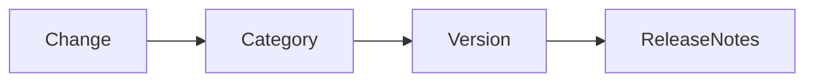

# Changelog

## Purpose

This changelog records user-visible changes to OpenContextPlatform.

## Goals

- Preserve a release history suitable for operators and SDK users.
- Separate documentation, specification, runtime, provider, connector, deployment, and security changes.
- Make breaking changes explicit.

## Architecture

The project will follow semantic versioning once implementation begins. Until then, changelog entries track foundation milestones.

## Diagrams

## Examples

### Unreleased

- Bootstrapped documentation-first monorepo structure.
- Added architecture book scaffold, RFC index, ADR index, and official specification documents.
- Established lifecycle rules for architecture-first development.

## Tradeoffs

Maintaining a changelog during bootstrap adds overhead, but it creates a habit of release-quality communication before the first package ships.

## Future Work

Automated release notes will be generated from pull requests after repository automation is introduced.
