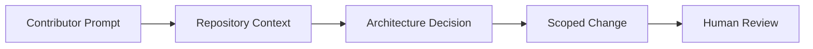

# CLAUDE

## Purpose

This file instructs Claude contributors working in this repository.

## Goals

- Follow the same architecture-first lifecycle as all other agents.
- Avoid speculative implementation when documentation is incomplete.
- Produce concise, reviewable changes with explicit assumptions.

## Architecture

Claude contributions must align with Clean Architecture, DDD, Hexagonal Architecture, CQRS where appropriate, Plugin Architecture, Event Driven integration, and Cloud Native operations.

## Diagrams

## Examples

Acceptable work includes drafting RFCs, refining specs, reviewing API boundaries, or updating documentation. Runtime code must wait for the required design gates.

## Tradeoffs

Different AI assistants have different strengths. This document keeps their outputs compatible by requiring the same repository process.

## Future Work

Assistant-specific contribution checks may be formalized as reusable prompts under `.ai/`.

Shared engineering instructions compatible with Claude Code.
