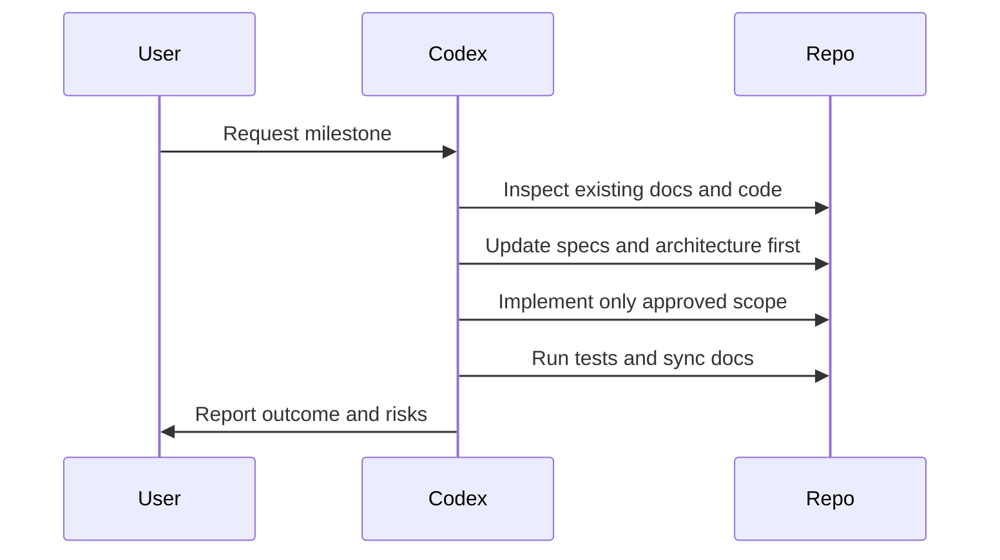

# CODEX

## Purpose

This file instructs Codex contributors working in this repository.

## Goals

- Never implement business logic before approved documentation and specifications exist.
- Prefer small, reviewable milestones over broad feature batches.
- Keep generated work maintainable, auditable, and aligned with the architecture book.

## Architecture

Codex must follow the project lifecycle exactly: RFC, Architecture, Database Design, API Design, Sequence Diagram, Implementation, Unit Tests, Integration Tests, Documentation, Review, and Release.

## Diagrams

## Examples

For a provider feature, Codex first updates the Provider Specification, writes or updates the RFC, records ADRs, designs APIs, and only then creates implementation files.

## Tradeoffs

Codex is optimized for momentum, but this repository prioritizes architectural stability over speed. More up-front review reduces rework later.

## Future Work

Codex-specific checklists will be enforced through CI once repository automation exists.
