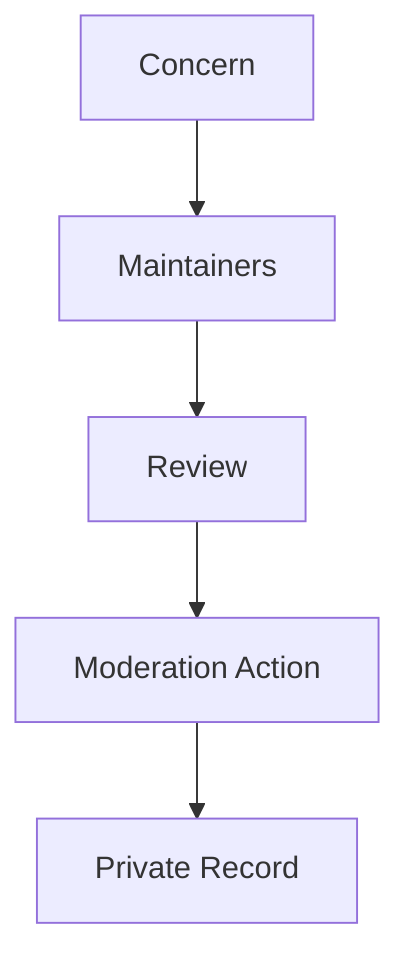

# Code of Conduct

## Purpose

OpenContextPlatform is an open-source infrastructure project. The community must be rigorous, respectful, and safe for people with different backgrounds and levels of experience.

## Goals

- Encourage technical disagreement without personal attacks.
- Make contribution spaces welcoming and professional.
- Protect maintainers and contributors from harassment.

## Architecture

Community moderation is part of project governance. Maintainers may warn, edit, hide, or remove content that violates this code, and may restrict participation when needed.

## Diagrams

## Examples

Expected behavior includes respectful review, clear feedback, crediting prior work, and assuming good intent while still holding high standards. Unacceptable behavior includes harassment, threats, doxxing, discriminatory language, and sustained disruption.

## Tradeoffs

Moderation requires judgment. The project will prefer transparent norms while protecting people who report harmful behavior.

## Future Work

The governance model will define escalation contacts, maintainer rotation, and community decision processes.

Be respectful and collaborative.
