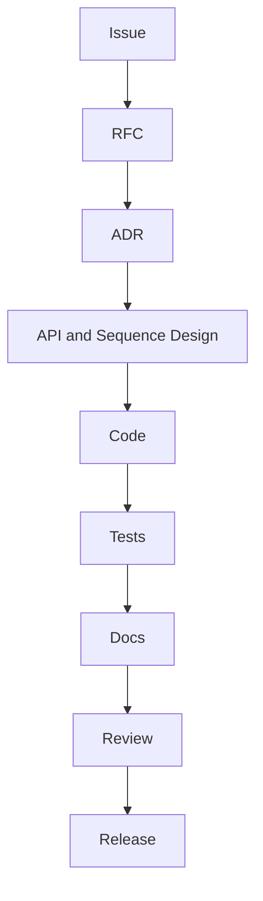

# Contributing

## Purpose

OpenContextPlatform welcomes contributions from individuals, companies, and research teams building AI context infrastructure.

## Goals

- Make contributions predictable and reviewable.
- Protect public specifications from accidental breaking changes.
- Keep documentation, tests, and implementation synchronized.

## Architecture

All meaningful changes start with an issue or RFC. Changes that affect domain behavior, APIs, persistence, provider contracts, connector contracts, deployment, security, or compatibility require an RFC and ADR before implementation.

## Diagrams

## Examples

- Documentation-only typo: pull request with explanation.
- New provider type: RFC, spec update, ADR, conformance tests, implementation, docs.
- Security-sensitive change: threat model, security review, tests, and migration notes.

## Tradeoffs

The contribution process is heavier than a typical application repository because this project defines contracts for an ecosystem.

## Future Work

Contributor automation will add issue templates, pull request templates, generated spec indexes, and conformance dashboards.
