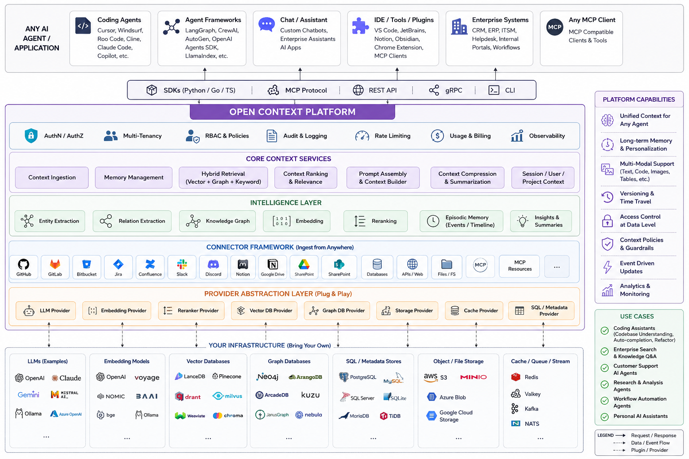
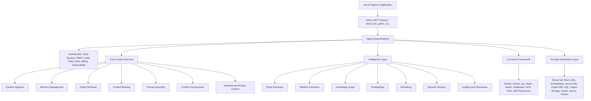

# OpenContextPlatform

> The Open Standard for AI Context

OpenContextPlatform is a provider-agnostic Context Runtime for AI agents, coding assistants, and enterprise AI applications. It defines open specifications and a pluggable runtime for retrieving, enriching, managing, ranking, and reasoning over contextual knowledge.

## Purpose

The project exists to make AI context infrastructure portable. Applications should be able to bring their own LLM, embedding model, graph database, vector database, storage layer, connectors, and security systems without rewriting their context layer.

## Goals

- Define stable, implementation-neutral context specifications.
- Provide a clean runtime architecture based on ports, adapters, and plugins.
- Support self-hosted, cloud-native, and managed OpenContext Cloud deployments.
- Make providers and connectors replaceable through explicit contracts.
- Treat documentation, RFCs, ADRs, tests, and specifications as release artifacts.

## Architecture

OpenContextPlatform follows Clean Architecture, Domain-Driven Design, Hexagonal Architecture, selective CQRS, event-driven integration, and cloud-native operations.

The canonical product architecture is a layered context platform that can serve any AI agent or application through SDKs, MCP, REST, gRPC, and CLI interfaces while keeping connectors, providers, and infrastructure fully pluggable.

Architecture layers:

- Any AI agent or application: coding agents, agent frameworks, chat assistants, IDE tools, enterprise systems, and MCP clients.
- Interface layer: SDKs for Python, Go, and TypeScript first, plus MCP Protocol, REST API, gRPC, and CLI.
- Platform capabilities: authentication, authorization, multi-tenancy, RBAC and policies, audit logging, rate limiting, usage and billing, and observability.
- Core context services: ingestion, memory management, hybrid retrieval, ranking, prompt assembly, compression, and session/user/project context.
- Intelligence layer: entity extraction, relation extraction, knowledge graph, embeddings, reranking, episodic memory, insights, and summaries.
- Connector framework: GitHub, GitLab, Bitbucket, Jira, Confluence, Slack, Discord, Notion, Google Drive, SharePoint, databases, APIs, filesystems, MCP, and MCP resources.
- Provider abstraction layer: LLM, embedding, reranker, vector database, graph database, storage, cache, and SQL/metadata providers.
- Bring-your-own infrastructure: commercial, open-source, and self-hosted models, vector stores, graph stores, metadata stores, object storage, cache, queues, and streams.

## Diagrams

The architecture book and specifications contain the canonical diagrams. Diagrams are authored in Mermaid so they can be reviewed as code and rendered consistently across documentation sites.

## Examples

Example use cases include coding assistants, enterprise search and knowledge Q&A, customer support AI agents, research and analysis agents, workflow automation agents, and personal AI assistants.

## Tradeoffs

OpenContextPlatform favors explicit contracts over hidden convenience. That increases initial design work, but protects long-term portability, testability, and enterprise adoption.

## Future Work

The bootstrap milestone establishes the documentation foundation only. Runtime implementation starts after the RFC, architecture, database, API, sequence diagram, test, and documentation gates are accepted.
