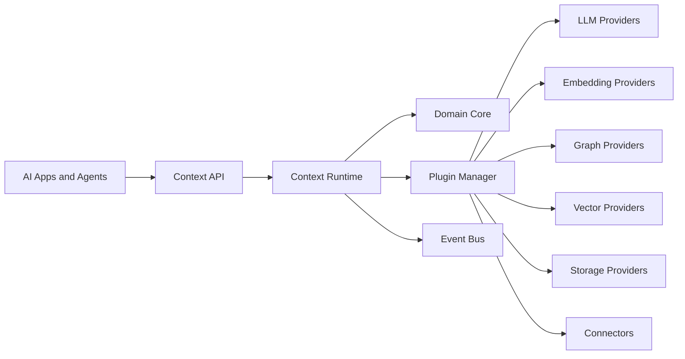

# OpenContextPlatform

> The Open Standard for AI Context

OpenContextPlatform is a provider-agnostic Context Runtime for AI agents, coding assistants, and enterprise AI applications. It defines open specifications and a pluggable runtime for retrieving, enriching, managing, ranking, and reasoning over contextual knowledge.

## Purpose

The project exists to make AI context infrastructure portable. Applications should be able to bring their own LLM, embedding model, graph database, vector database, storage layer, connectors, and security systems without rewriting their context layer.

## Goals

- Define stable, implementation-neutral context specifications.
- Provide a clean runtime architecture based on ports, adapters, and plugins.
- Support self-hosted, cloud-native, and managed OpenContext Cloud deployments.
- Make providers and connectors replaceable through explicit contracts.
- Treat documentation, RFCs, ADRs, tests, and specifications as release artifacts.

## Architecture

OpenContextPlatform follows Clean Architecture, Domain-Driven Design, Hexagonal Architecture, selective CQRS, event-driven integration, and cloud-native operations.

## Diagrams

The architecture book and specifications contain the canonical diagrams. Diagrams are authored in Mermaid so they can be reviewed as code and rendered consistently across documentation sites.

## Examples

Example use cases include coding-agent repository context, enterprise knowledge retrieval, support copilots, policy-aware prompt building, and multi-provider retrieval pipelines.

## Tradeoffs

OpenContextPlatform favors explicit contracts over hidden convenience. That increases initial design work, but protects long-term portability, testability, and enterprise adoption.

## Future Work

The bootstrap milestone establishes the documentation foundation only. Runtime implementation starts after the RFC, architecture, database, API, sequence diagram, test, and documentation gates are accepted.
