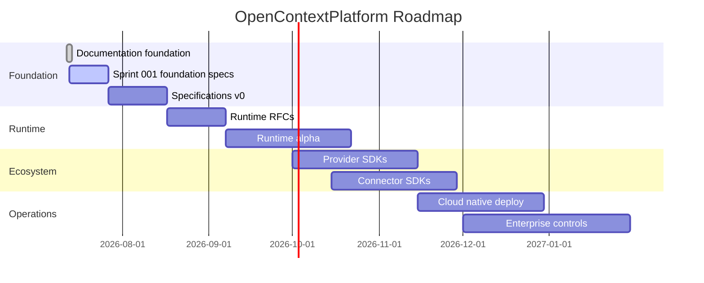

# Roadmap

## Purpose

This roadmap defines the order in which OpenContextPlatform becomes a production-grade open standard for AI context infrastructure.

## Goals

- Complete the documentation and specification foundation before implementation.
- Deliver one milestone at a time with synchronized docs, specs, tests, and reviews.
- Keep provider, connector, runtime, cloud, and enterprise work independently extensible.

## Architecture

Roadmap milestones follow the project lifecycle: RFC, Architecture, Database Design, API Design, Sequence Diagram, Implementation, Unit Tests, Integration Tests, Documentation, Review, and Release.

The roadmap is executed through controlled documentation loops. Each loop defines the task, context, allowed actions, verification checks, persisted progress, outputs, and stop or escalation rules before work begins.

## Diagrams

## Examples

Milestone 0 creates the monorepo, docs, book, RFCs, ADRs, and specifications. Sprint 001 turns that foundation into reviewable specification work using the agentic loop artifacts under `.ai/loops/sprint-001-foundation-specs/`. Milestone 1 validates runtime architecture. Milestone 2 introduces provider and connector SDKs.

### Sprint 001: Foundation Specifications

Sprint 001 runs from 2026-07-13 to 2026-07-26. Its objective is to harden the documentation foundation into a specification-ready baseline without implementing business logic.

Sprint 001 deliverables:

- Specification maturity matrix for context, memory, providers, connectors, plugins, retrieval, ranking, and prompt builder.
- RFC backlog for runtime architecture, plugin lifecycle, provider SDK, connector SDK, API versioning, and conformance.
- ADR backlog for monorepo governance, specification stability, plugin model, and API-first contracts.
- Documentation quality checks for required sections, diagrams, and lifecycle alignment.
- Review package in `.ai/loops/sprint-001-foundation-specs/outputs/`.

## Tradeoffs

The roadmap intentionally delays business logic. This slows early demos but prevents unstable APIs and undocumented architecture from becoming accidental standards.

## Future Work

Future releases will add conformance suites, compatibility matrices, performance benchmarks, and long-term support policy.
