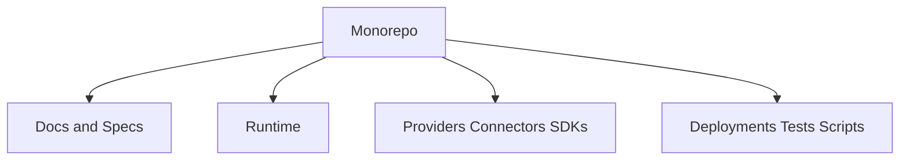

# ADR 0001: Adopt Documentation-First Monorepo

## Purpose

This ADR records the decision to bootstrap OpenContextPlatform as a documentation-first monorepo.

## Goals

- Establish architecture and specification boundaries before code.
- Keep all first-party platform assets in one repository during early development.
- Make future package extraction a deliberate decision rather than an accident.

## Architecture

The monorepo contains documentation, specs, RFCs, ADRs, runtime, packages, providers, connectors, SDKs, deployments, examples, tests, and scripts.

## Diagrams

## Examples

Provider SDKs for Python, TypeScript, Go, Java, Rust, and .NET can share conformance fixtures while still preserving language-specific packages.

## Tradeoffs

A monorepo can become large and require strong tooling. Early in the project, it gives better consistency across specs, docs, and implementation.

## Future Work

Future ADRs will decide package managers, language boundaries, build systems, and release automation.
