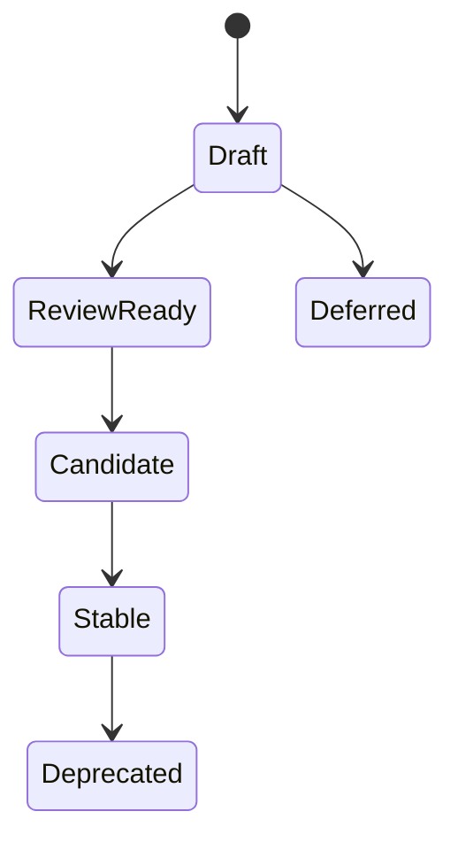

# ADR 0002: Adopt Specification Stability Levels

## Purpose

This ADR accepts RFC-003 and records the specification stability model for OpenContextPlatform.

## Goals

- Establish maturity levels for specifications.
- Prevent implementation from depending on incomplete contracts.
- Define promotion gates for Draft, Review Ready, Candidate, Stable, Deferred, and Deprecated specifications.

## Architecture

Specifications move through explicit stability levels. Candidate and Stable specifications require RFC and ADR evidence, security review where applicable, compatibility notes, and conformance planning.

## Diagrams

## Examples

The Context Specification remains Draft until RFC-002 review updates the contract and required schema and conformance work is scoped.

## Tradeoffs

Formal stability gates slow early implementation. The benefit is that downstream SDK, provider, connector, and enterprise users can distinguish exploratory documents from reliable contracts.

## Future Work

Update all specifications with status headers and add CI checks for required stability evidence.
