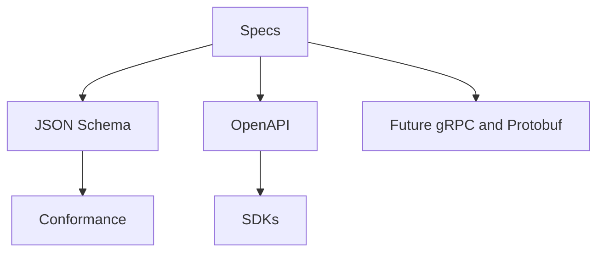

# ADR 0003: Adopt API-First Contract Strategy

## Purpose

This ADR accepts RFC-008 and records the API-first contract strategy for OpenContextPlatform.

## Goals

- Keep public APIs derived from specifications.
- Use schemas to align REST, SDKs, conformance tests, and future gRPC surfaces.
- Block hand-written public interfaces that drift from specification contracts.

## Architecture

REST APIs will be described with OpenAPI. Shared domain shapes will use JSON Schema where practical. gRPC and protobuf remain deferred until streaming or service-to-service performance requirements justify them.

## Diagrams

## Examples

A retrieval API must return context objects defined by the Context Object Contract and expose errors, pagination, idempotency, and compatibility behavior through the same public schema strategy.

## Tradeoffs

API-first design adds schema work before implementation. The benefit is compatibility, SDK generation, and conformance testing.

## Future Work

Define source-of-truth schema ownership, error taxonomy, API version path or header strategy, and SDK generation tooling.
