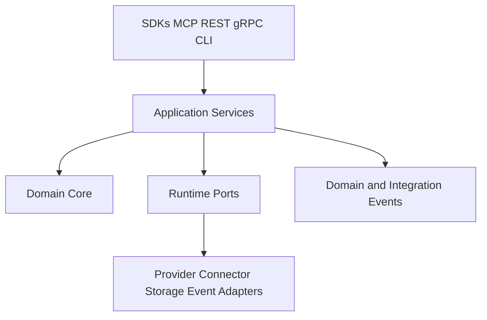

# ADR 0004: Adopt Runtime Clean Architecture Boundaries

## Purpose

This ADR accepts RFC-004 and records the runtime architecture boundaries for OpenContextPlatform.

## Goals

- Keep domain logic independent from frameworks and vendors.
- Define runtime boundaries for domain, application services, ports, adapters, interfaces, control plane, and data plane.
- Unblock future runtime scaffolding after remaining accepted ADR prerequisites are in place.

## Architecture

The runtime follows Clean Architecture and Hexagonal Architecture. Domain owns core invariants. Application services orchestrate use cases. Ports define required capabilities. Adapters integrate providers, connectors, persistence, events, and external systems.

## Diagrams

## Examples

Retrieval orchestration belongs in application services. Context identity and lifecycle belong in the domain. Vector database calls belong in provider adapters. Source ingestion belongs in connector adapters.

## Tradeoffs

The architecture creates more boundaries than a simple service. The benefit is extensibility, testability, provider neutrality, connector flexibility, and enterprise readiness.

## Future Work

Define ingestion and retrieval sequence diagrams, database design, runtime package layout, and event semantics before runtime code is added.
