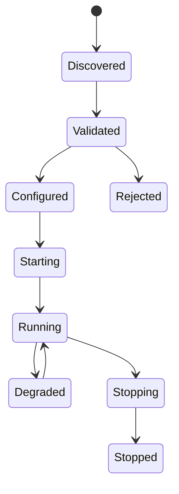

# ADR 0005: Adopt Plugin Lifecycle and Isolation Model

## Purpose

This ADR accepts RFC-005 and records the plugin lifecycle and isolation model direction for OpenContextPlatform.

## Goals

- Establish plugin discovery, validation, configuration, startup, health, degradation, shutdown, and upgrade states.
- Require manifest-driven capabilities and compatibility checks.
- Treat plugin trust and isolation as security boundaries.

## Architecture

Plugins extend runtime ports. The runtime owns plugin lifecycle orchestration, compatibility checks, health observation, policy enforcement, and shutdown. Plugins declare capabilities through manifests and operate only through approved runtime ports.

## Diagrams

## Examples

A vector database provider plugin declares runtime compatibility, supported spec versions, configuration schema, capabilities, health checks, and required secret references.

## Tradeoffs

Plugin isolation and manifest validation increase operational complexity. The benefit is safer third-party provider and connector ecosystems.

## Future Work

Select the first isolation mechanism, define plugin manifest schema, define signing policy, and add security conformance fixtures.
