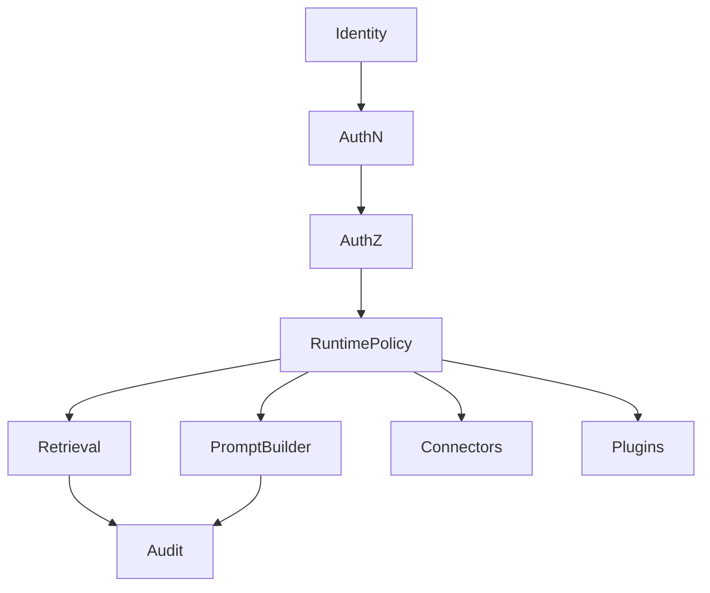

# ADR 0009: Adopt Enterprise Security Posture

## Purpose

This ADR accepts RFC-010 and records the enterprise security posture for OpenContextPlatform.

## Goals

- Treat authentication, authorization, tenancy, connector permissions, plugin trust, prompt safety, secrets, audit, and supply chain as first-class architecture concerns.
- Block implementation paths that cannot preserve source permissions or tenant boundaries.
- Require security review before connector, memory, prompt, provider, plugin, or deployment implementation.

## Architecture

Security is a cross-cutting platform capability enforced at interfaces, application services, domain policy references, providers, connectors, plugins, storage, events, and observability.

## Diagrams

## Examples

A Slack message must preserve source permissions through ingestion, retrieval, ranking, prompt assembly, memory derivation, and audit. Unauthorized users must not receive the message as context or citation.

## Tradeoffs

Security-first architecture adds design effort and may add runtime latency. The benefit is enterprise suitability and reduced risk of data leakage.

## Future Work

Define RBAC or ABAC policy model, audit event schema, secret manager abstraction, prompt injection mitigations, and supply-chain requirements.
