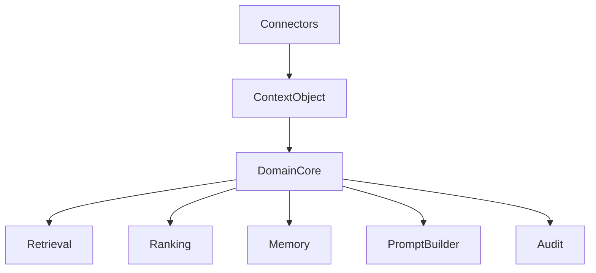

# ADR 0011: Adopt Context Object Contract

## Purpose

This ADR accepts RFC-002 and records the Context Object Contract as the foundational domain contract for OpenContextPlatform.

## Goals

- Establish the context object as the portable unit of knowledge across the platform.
- Define identity, type, content, metadata, provenance, policy, relationships, lifecycle, scores, and timestamps as required semantic areas.
- Unblock schema design, API design, retrieval design, ranking design, memory design, connector mapping, provider conformance, and prompt package design.

## Architecture

The context object belongs to the domain core. Connectors produce it, application services enrich and orchestrate it, providers index and store it through ports, retrieval and ranking services score it, memory services may derive from it, and prompt builders cite it.

## Diagrams

## Examples

A code chunk, Jira ticket, Slack message, SQL row, memory summary, and graph node can all be represented as context objects when identity, provenance, policy, relationships, and lifecycle are explicit.

## Tradeoffs

The accepted contract is richer than a simple text chunk. The added structure is necessary for permission-safe retrieval, explainable ranking, durable memory, prompt citation, audit, and provider-neutral storage.

## Future Work

Define the context JSON Schema, lifecycle transition rules, policy schema, canonical hashing strategy, OpenAPI references, and conformance fixtures before runtime implementation.
