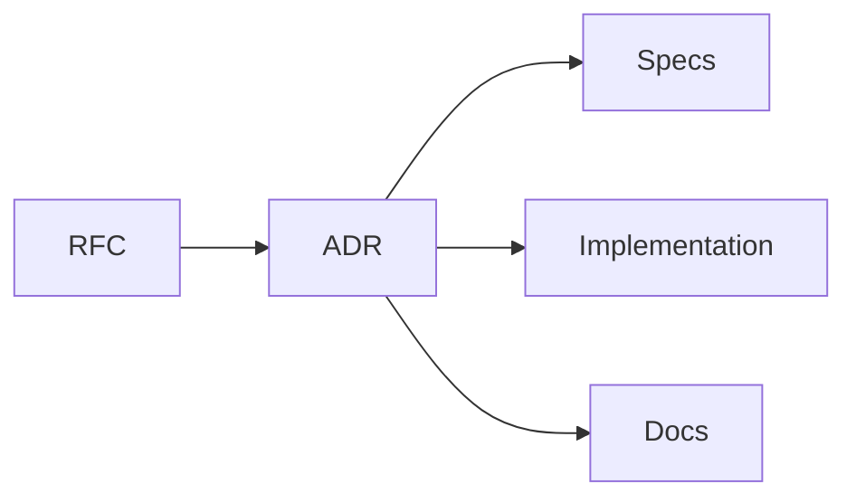

# ADRs

## Purpose

Architecture Decision Records capture accepted technical decisions and their consequences.

## Goals

- Preserve decision history.
- Link accepted decisions to RFCs and specifications.
- Make tradeoffs explicit for future maintainers.

## Architecture

ADRs are immutable records. If a decision changes, a new ADR supersedes the old one.

## Diagrams

## Examples

ADRs may record decisions about Clean Architecture, plugin isolation, API versioning, storage strategy, or SDK language support.

## Tradeoffs

ADRs do not replace discussion. They summarize decisions after review so future contributors understand context.

## Future Work

ADR templates, indexing, and status validation will be added through repository automation.
