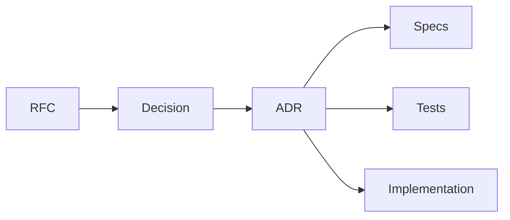

# ADR Backlog

## Purpose

This backlog defines Architecture Decision Record candidates that should be produced as RFCs are accepted.

## Goals

- Keep accepted decisions traceable to RFCs and specifications.
- Identify decisions that block implementation.
- Prevent undocumented architecture drift.

## Architecture

ADR candidates are created from RFC review. Accepted ADRs are immutable records that update the architecture book, specifications, implementation plans, tests, and release notes.

## Diagrams

## Examples

If RFC-005 accepts a plugin isolation model, the corresponding ADR records the chosen model, rejected alternatives, operational consequences, and security implications.

### ADR Candidates

| Candidate | Decision | Linked RFCs | Linked Specifications | Owner Role | Proposed Sprint |
| --- | --- | --- | --- | --- | --- |
| ADR-002 | Adopt specification stability levels | RFC-003 | all specs | Architect | Accepted in `adr/0002-adopt-specification-stability-levels.md` |
| ADR-003 | Adopt API-first contract strategy | RFC-008 | context, retrieval, ranking, prompt builder | Architect | Accepted in `adr/0003-adopt-api-first-contract-strategy.md` |
| ADR-004 | Adopt runtime Clean Architecture boundaries | RFC-004 | context, memory, retrieval, ranking | Architect | Accepted in `adr/0004-adopt-runtime-clean-architecture-boundaries.md` |
| ADR-005 | Adopt plugin lifecycle and isolation model | RFC-005 | plugin, provider, connector | Security | Accepted in `adr/0005-adopt-plugin-lifecycle-and-isolation-model.md` |
| ADR-006 | Adopt provider port taxonomy | RFC-006 | provider, plugin | Architect | Sprint 003 |
| ADR-007 | Adopt connector sync and permission model | RFC-007 | connector, context, plugin | Security | Sprint 003 |
| ADR-008 | Adopt conformance-first testing strategy | RFC-009 | all specs | Tester | Sprint 001 |
| ADR-009 | Adopt enterprise security posture | RFC-010 | connector, plugin, prompt builder, memory | Security | Accepted in `adr/0009-adopt-enterprise-security-posture.md` |
| ADR-010 | Adopt monorepo package governance | RFC-004, RFC-006, RFC-007 | provider, connector, plugin | Reviewer | Sprint 002 |
| ADR-011 | Adopt context object contract | RFC-002 | context, memory, retrieval, ranking, prompt builder, connector | Architect | Accepted in `adr/0011-adopt-context-object-contract.md` |

### Blocking Decisions

The following ADRs block implementation until accepted or until their follow-up decisions are resolved:

- ADR-002 is accepted and unblocks specification promotion planning.
- ADR-011 is accepted and unblocks context schema, API, database, and sequence design planning.
- ADR-004 is accepted and unblocks runtime scaffolding planning after sequence diagrams and database/API design are complete.
- ADR-005 is accepted directionally, but provider and connector plugin implementation remains blocked until isolation mechanism and manifest schema follow-ups are accepted.
- ADR-008 blocks executable conformance tests.
- ADR-009 is accepted directionally, but enterprise-facing connector, memory, and prompt behavior remain blocked until policy model and audit schema follow-ups are accepted.

## Tradeoffs

Maintaining an ADR backlog creates more planning artifacts, but it prevents major decisions from being buried in RFC comments or implementation details.

## Future Work

Future ADR work should create template files, add status values, and link accepted ADRs from the architecture book and relevant specifications.
