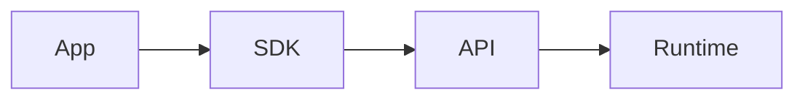

# Apps

## Purpose

This directory will contain first-party applications that use the OpenContextPlatform runtime.

## Goals

- Keep product-facing apps separate from runtime and SDK packages.
- Demonstrate real workflows without coupling the runtime to one interface.
- Support future web, CLI, admin, and developer-tool applications.

## Architecture

Apps depend on public APIs and SDKs. They must not import runtime internals directly.

## Diagrams

## Examples

Future apps may include an admin console, local developer UI, connector management UI, or hosted cloud dashboard.

## Tradeoffs

Keeping apps separate avoids turning the runtime into a product-specific backend.

## Future Work

Application scaffolding will begin only after API and SDK designs are approved.
