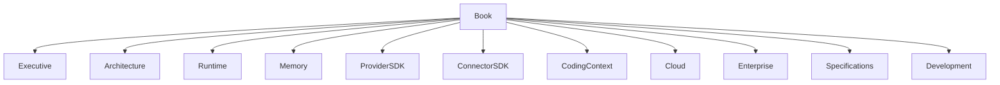

# Architecture Book

## Purpose

The OpenContextPlatform Architecture Book is the long-form reference for the platform. Version 1.0 begins as a structured foundation and is intended to grow beyond 500 pages as the project matures.

## Goals

- Preserve architectural intent across releases.
- Teach contributors how the platform fits together.
- Provide standalone chapters for runtime, memory, SDKs, cloud, enterprise, specifications, and development.

## Architecture

The book is divided into eleven volumes. Each chapter is a Markdown document so it can be versioned, reviewed, linked, and rendered with the rest of the documentation.

## Diagrams

## Examples

Architecture reviewers should cite book chapters when evaluating RFCs and ADRs.

## Tradeoffs

A book requires editorial discipline. The benefit is a durable, high-context reference similar to mature infrastructure projects.

## Future Work

Future versions will add multi-chapter volumes, diagrams, glossary, compatibility tables, and generated API references.
