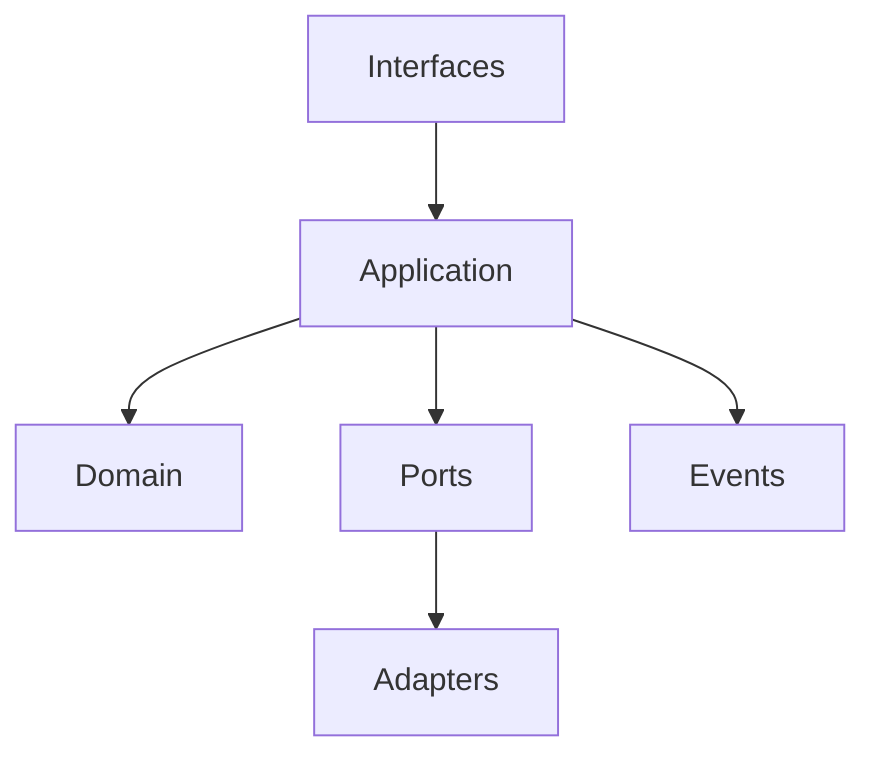

# Volume 2: Architecture

## Purpose

This volume defines the system architecture for OpenContextPlatform.

## Goals

- Establish clean boundaries between domain, application, adapters, and infrastructure.
- Define extension points for plugins.
- Describe event-driven and cloud-native concerns.

## Architecture

The architecture is built around a stable domain core, application services, runtime ports, provider adapters, connector adapters, and operational control planes.

## Diagrams

## Examples

Context policy belongs in the domain. Retrieval orchestration belongs in application services. Vector search belongs behind a provider adapter.

## Tradeoffs

Strong boundaries require more files and design work, but they allow independent provider, connector, and deployment evolution.

## Future Work

This volume will expand into domain model, bounded contexts, deployment views, plugin lifecycle, and observability chapters.
